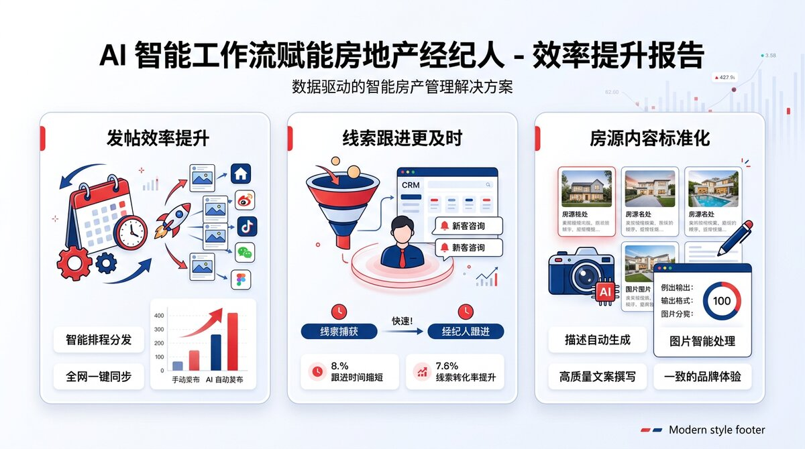
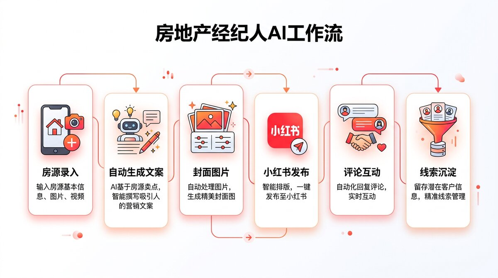
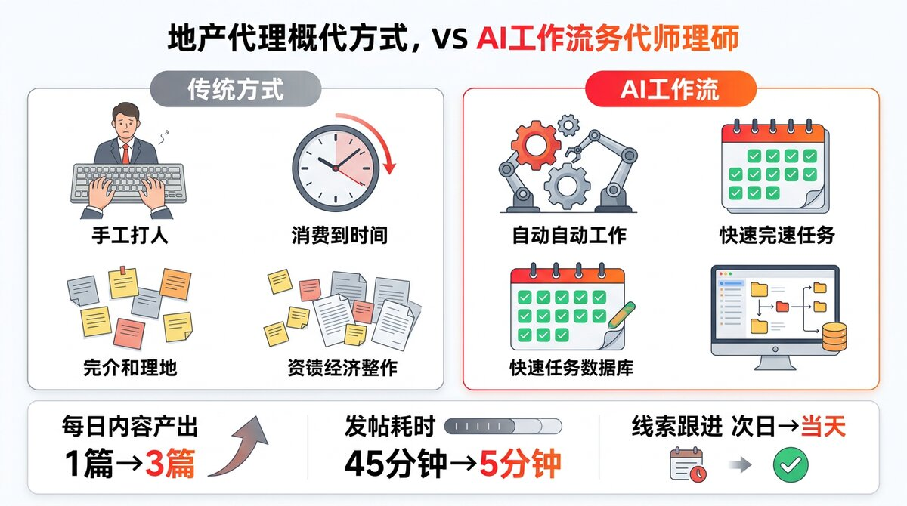
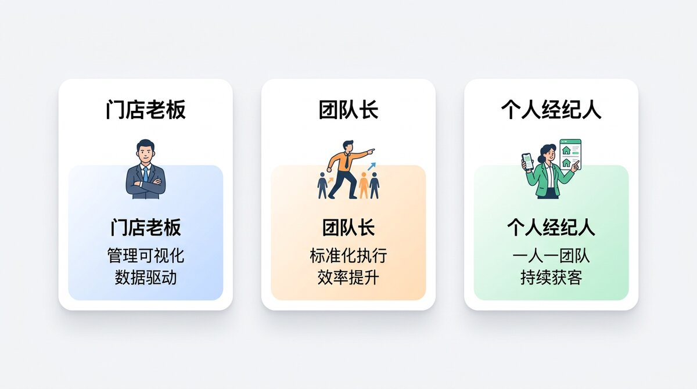

# 房地产经纪人 AI 获客工作流

> 让房源内容生产、发布、互动、线索沉淀从"人盯流程"变成"流程帮你做事"。


`OpenClaw` `小红书自动发布` `Notion房源库` `QQ触发` `中国房产经纪人`

---

### 目录

- [一眼看懂](#一眼看懂)
- [为经纪人带来的价值](#它为中国房产经纪人带来的价值)
- [效率提升点](#效率提升点)
- [工作流一览](#工作流一览)
- [传统方式 vs AI 工作流](#传统方式-vs-ai-工作流)
- [谁最适合用](#谁最适合用这套系统)
- [实际使用场景](#对经纪人的实际使用场景)
- [快速使用](#快速使用)
- [图片建议](#图片建议)
- [技术栈](#技术栈)
- [微信群聊获客能力](#微信群聊获客能力规划中)
- [下一步增强](#下一步可继续增强)

---

## 一眼看懂

这是一个专门为中国房地产经纪人设计的 `OpenClaw + 小红书 + Notion + QQ` 自动化工作流。

你录入房源，它负责把房源变成内容，再把内容变成持续获客动作：

| 步骤 | 动作 |
|:---:|---|
| 1 | 新房源进入 Notion 房源数据库 |
| 2 | AI 自动生成适合小红书的文案与标签 |
| 3 | 自动准备封面图或调用已有房源图 |
| 4 | 通过 QQ 指令或定时任务（每日 17:00）触发发布 |
| 5 | 互动沉淀、线索记录，形成可复盘的数据闭环 |

如果你希望把"小红书发帖"从偶尔做一次，变成每天稳定执行的获客动作，这套流程就是为这个目标准备的。

**适合**：二手房经纪人 / 租赁经纪人 / 新房渠道顾问 / 个人 IP 型房产博主 / 社媒流量转私域的小团队

## 它为中国房产经纪人带来的价值

很多经纪人的时间，不是花在成交上，而是花在"重复搬运"上：

- 房源有了，但还没来得及写内容
- 内容写了，但没有合适封面
- 想发小红书，但要手动整理素材
- 发出去后，评论跟进不及时
- 客户意向散落在聊天、表格、脑子里

这个工作流的核心价值，就是把这些碎片动作收口成一个统一流程。

### 1. 更快把房源变成内容

新增房源后，系统可以自动读取房源信息，生成适合小红书风格的标题、正文、标签和封面图，大幅减少"从空白开始写"的时间。

### 2. 更稳定地保持发帖频率

经纪人最怕"忙成交时停更，停更后没线索"。这个流程支持：

- QQ 指令触发即时发帖
- 每天北京时间 `17:00` 自动检查新房源并发帖

这样就算当天很忙，也不会完全断更。

### 3. 更及时地承接社媒线索

评论、互动、潜在线索会进入结构化记录，不再只是零散存在聊天窗口里，方便后续筛选"谁只是看看、谁是真需求、谁值得马上跟进"。

### 4. 更适合中国本地业务场景

它围绕国内经纪人的真实工作方式设计：

- 用 `小红书` 做内容获客
- 用 `QQ` 作为机器人触发入口
- 用 `Notion` 做内容库、房源库、线索库
- 用适合中文房产语境的内容风格输出

## 效率提升点

| 传统方式 | 使用本流程后 |
|---|---|
| 房源整理完还要手写文案 | 房源入库后可自动生成文案 |
| 封面图临时找素材、临时排版 | 可直接使用房源图，或自动生成封面 |
| 发帖靠记忆，忙起来就断更 | 支持 QQ 触发 + 每日定时发帖 |
| 评论回复容易延迟 | 可基于流程做互动跟进 |
| 客资分散在多个地方 | 统一沉淀到 Notion 数据库 |
| 很难复盘"哪类内容带来客户" | 可逐步形成内容与线索闭环 |

> 不是替代经纪人，而是把经纪人的时间从重复劳动里释放出来，把更多精力留给带看、谈判、成交和客户经营。



### 这套系统最适合提升的 3 件事

#### 1. 发帖效率

对很多经纪人来说，真正难的不是"会不会写"，而是"每天有没有时间稳定写、稳定发"。这套系统把房源信息直接转成可发布内容，让发帖从临时起意变成流程动作。

#### 2. 跟进速度

内容发出去之后，真正有价值的是互动后的承接。把线索记录下来，比单纯多发几篇更重要。系统把互动、线索、状态统一留在数据层里，更适合后续跟进。

#### 3. 内容标准化

同一个团队里，不同经纪人的内容质量常常不稳定。用统一的房源字段、统一的内容结构、统一的发布动作，可以明显减少"今天写得好、明天全靠发挥"的问题。

## 工作流一览



### 当前链路

1. 把新房源录入 `房源列表 Property Listings`
2. 系统识别 `XHSPostStatus = new` 的房源
3. 自动生成适合小红书的房源推荐文案
4. 自动生成或调用现有封面图片
5. 发布到小红书
6. 把互动与线索继续沉淀到 Notion

## 当前已接入的核心模块

### 小红书内容与发布

- 已接入小红书 MCP
- 支持图文发布
- 支持搜索、互动、评论相关能力

### Notion 数据层

已建立以下核心数据库：

- `XHS Content Calendar`
- `XHS Post Drafts`
- `XHS Engagement Logs`
- `Social Leads`
- `房源列表 Property Listings`

### 自动发房源能力

已新增 `xhs-property-post` 技能，支持：

- 读取新房源
- 自动生成帖子
- 调用图片
- 发布到小红书
- 发布后回写状态

### 触发方式

- QQ 指令：`发房源`、`推广新房源`
- 定时任务：每天北京时间 `17:00`

## 对经纪人的实际使用场景

### 场景 1：当天新上 2 套优质房源

你只需要把房源录入到 Notion，系统就能在固定时间自动发帖，帮你保持内容输出频率。

### 场景 2：下班前想快速补一条内容

你可以直接给 QQ 机器人发一句：

```text
发房源
```

系统会读取新的房源并执行发帖流程。

### 场景 3：团队希望把内容获客做成标准动作

这套流程可以把"写文案的人""发帖的人""跟评论的人"之间的交接减少，让房源、内容、线索都留在统一系统里。

### 场景 4：门店负责人想看结果而不是盯过程

负责人不需要每天追着问"今天发了没有""这个客户是谁接的"，而是直接通过结构化数据看到：

- 哪些房源正在排队待发
- 哪些内容已经发布
- 哪些互动正在转化成客户
- 哪些线索应该优先跟进

## 快速使用

### 1. 新增房源

在 `房源列表 Property Listings` 数据库中新增一条记录，并填写：

- `Name`
- `PropertyType`
- `District`
- `Area`
- `Price`
- `PriceUnit`
- `Rooms`
- `Size`
- `Highlights`
- `ImagePaths`
- `XHSPostStatus = new`

### 2. 选择发帖方式

方式 A：QQ 中发送

```text
发房源
```

方式 B：等待系统在每天 `17:00` 自动执行

### 3. 查看结果

发布完成后，可在 Notion 中查看：

- 房源状态是否更新为 `posted`
- 发布时间是否已写入
- 后续互动和线索是否继续沉淀

## 图片建议

为了让小红书内容更像"真实经纪人笔记"而不是"硬广"，建议房源图片优先使用：

- 采光最好的客厅图
- 干净整洁的卧室图
- 小区外立面或园区图
- 周边配套图
- 户型图

推荐一套常用顺序：

1. 封面图：最吸引点击的一张
2. 客厅图：体现采光和空间感
3. 卧室图：体现居住舒适度
4. 厨卫图：体现真实维护情况
5. 小区或周边图：体现生活配套
6. 户型图：增强决策信息密度

当前也支持没有素材时先自动生成封面图，用于快速试跑流程。

---

## 传统方式 vs AI 工作流



| 维度 | 传统方式 | 使用本系统后 |
|---|---|---|
| 一条帖子从构思到发布 | 30-60 分钟 | 5 分钟确认即可 |
| 每周稳定发帖频率 | 取决于个人意志力 | 系统保底每天执行 |
| 线索跟进遗漏率 | 高（散落在多个地方） | 低（统一进 Notion） |
| 团队内容质量一致性 | 参差不齐 | 统一结构，稳定输出 |
| 负责人了解执行情况 | 靠问、靠汇报 | 看数据库即可 |

### 投入产出的核心逻辑

这套系统不需要你多花钱买流量，而是帮你把已有的房源信息更高效地变成"内容资产"，让每一条房源都有机会被更多人看到。

对于经纪人来说，最贵的成本不是工具，而是时间。这套流程省下来的，正是你每天花在"重复搬运"上的那些时间。

---

## 谁最适合用这套系统



### 门店负责人

你关心的是团队整体的内容产出效率和获客转化。这套系统让你：

- 不用每天追问"今天发了没"——系统自动执行，Notion 里一目了然
- 不用担心员工离职带走内容和客资——所有数据沉淀在统一数据库
- 可以直接看到哪些房源已推广、哪些还没发、哪些线索在跟进
- 团队内容质量不再依赖个人能力，而是依赖统一流程

**适合你的用法**：让团队统一使用 Notion 房源库录入，系统自动帮全店发帖，你只需要定期看数据。

### 团队经纪人

你的时间更多花在带看、谈判、成交上，没精力天天写小红书。这套系统让你：

- 录入房源后不用再额外花时间写文案——系统帮你生成
- 不需要学习排版和设计——封面图自动准备
- 发帖变成一句话的事——QQ 里说"发房源"就行
- 互动线索有据可查——不会因为忙而漏掉潜在客户

**适合你的用法**：每天花 5 分钟把新房源录入 Notion，剩下的交给系统。

### 个人 IP 博主

你希望在小红书上持续输出房产内容，建立个人品牌。这套系统让你：

- 保持稳定更新频率——就算出差、带看也不断更
- 内容风格统一——每篇都像"专业经纪人笔记"而不是硬广
- 从内容到线索形成闭环——不只是"发着玩"，而是真正能带来客户
- 可以专注在选题和客户经营上——执行层面交给流程

**适合你的用法**：定好选题方向，录入房源素材，系统帮你持续产出和发布。

---

## 当前最适合的结果

如果你是中国房地产经纪人，这套系统最直接的意义不是"炫技"，而是：

- 让每一套新房源更快变成一篇可发布内容
- 让内容获客从偶发行为变成稳定动作
- 让线索不再丢在聊天记录里
- 让一个人也能做出更接近小团队的内容运营效率

---

## 技术栈

| 组件 | 说明 |
|---|---|
| OpenClaw | AI Agent 运行时，负责技能调度、定时任务、多渠道消息 |
| 小红书 MCP | 小红书内容发布、搜索、互动的 API 层 |
| Notion (via Maton) | 房源库、内容库、线索库、状态管理 |
| QQ Bot | 用户触发入口，接收执行结果 |
| WeCom 插件 | 企业微信群聊接入（规划中） |
| ImageMagick | 自动生成封面图（无素材时的兜底方案） |

---

## 微信群聊获客能力（规划中）

除了小红书内容获客，经纪人真正的业务交流和房源流通大量发生在 **微信群** 里。这是下一个重点建设方向。

### 核心场景

#### 1. 微信群房源自动监控

经纪人通常加了几十个甚至上百个同行群、房源群、业主群。群里每天大量房源信息刷屏，靠人工逐条看根本看不过来。

**目标**：让系统自动监听微信群消息，识别房源信息（户型、价格、面积、位置等），结构化提取后存入 Notion 房源数据库。

**能力拆解**：

| 步骤 | 动作 | 实现方式 |
|:---:|---|---|
| 1 | 接入微信群消息 | 企业微信插件 `@wecom/wecom-openclaw-plugin` 或社区插件 `openclaw-wechat` |
| 2 | 识别房源消息 | LLM 结构化提取（从自然语言中抽取户型/价格/面积/位置） |
| 3 | 写入 Notion | 通过 Maton API 写入「房源列表」数据库，标记来源为群聊 |
| 4 | 去重判断 | 对比已有房源，避免重复录入 |

#### 2. 小红书拓群 — 主动发现新微信群

很多房产微信群的入口散落在小红书帖子评论区、个人简介里。手动翻找效率极低。

**目标**：定期在小红书搜索特定关键词（如"北京买房群""朝阳租房交流"），从帖子和评论中识别微信群入口线索，汇总后提醒经纪人手动加群。

**能力拆解**：

| 步骤 | 动作 | 实现方式 |
|:---:|---|---|
| 1 | 搜索小红书 | XHS MCP `search_feeds` + `get_comments` |
| 2 | 识别群入口 | LLM 分析评论/正文，提取"加群""入群""微信群"等线索 |
| 3 | 记录线索 | 写入 Notion「Social Leads」或新建「微信群线索」数据库 |
| 4 | 提醒经纪人 | 通过 QQ 消息推送汇总，经纪人手动扫码加群 |

#### 3. 客户咨询智能匹配 — 群聊找房源

当客户在 QQ 或微信中提出需求（如"朝阳两居 500 万以内"），如果 Notion 房源库中没有匹配的：

**目标**：自动在已监控的微信群历史消息中搜索匹配房源，找到后推荐给经纪人，再由经纪人转达给客户。

**能力拆解**：

| 步骤 | 动作 | 实现方式 |
|:---:|---|---|
| 1 | 解析客户需求 | LLM 提取意向字段（区域/户型/预算/面积） |
| 2 | 查 Notion 库 | Maton API 按条件查询「房源列表」 |
| 3 | 如无匹配，查群聊记录 | 搜索微信群历史消息中的房源信息 |
| 4 | 汇总推荐 | 生成匹配报告推送给经纪人 |

### 技术方案与可用组件

| 组件 | 说明 | 状态 |
|---|---|---|
| `wecom` 插件 | 已安装在 OpenClaw，企业微信通道，支持群聊 | 已安装，待配置 |
| `@wecom/wecom-openclaw-plugin` | 腾讯官方企业微信插件，支持 WebSocket + 群监控 | 可安装 |
| `openclaw-wechat` (Xueheng-Li) | 社区企业微信插件，支持个人微信桥接 | 可安装 |
| XHS MCP `search_feeds` | 小红书搜索，用于拓群 | 已就绪 |
| XHS MCP `get_comments` | 小红书评论读取，用于识别群入口 | 已就绪 |
| Notion (Maton API) | 房源存储、线索记录 | 已就绪 |
| `easy-search` 技能 | 无 API 的网页搜索，辅助拓群 | 已就绪 |

### 需要自行开发的部分

以上组件覆盖了通道接入和数据存储，但以下逻辑需要自行开发（OpenClaw Skill 形式）：

1. **群消息房源提取 Skill** — 监听群消息流 → LLM 结构化提取 → 写入 Notion
2. **群聊历史搜索 Skill** — 按关键词/条件在已存储的群消息中检索
3. **拓群线索汇总 Skill** — 定期搜索小红书 → 识别微信群线索 → 推送汇总
4. **客户需求匹配 Skill** — 解析客户意向 → 查库 → 查群聊 → 生成推荐

### 微信接入的前置条件

| 条件 | 说明 |
|---|---|
| 企业微信账号 | 需要一个企业微信组织，创建自建应用 |
| 配置回调地址 | 服务器需要公网 IP 或域名，端口开放 |
| 企业微信管理后台 | 配置 CorpID / Secret / AgentID / Token / EncodingAESKey |
| 个人微信关联（可选） | 通过企业微信管理后台邀请个人微信加入，实现个人微信消息桥接 |

---

## 下一步可继续增强

- 接入 `Attio CRM`，把社媒线索同步进 CRM
- **微信群房源监控** — 自动从群聊中提取房源信息入库
- **小红书拓群** — 定期搜索小红书发现新微信群入口
- **客户需求智能匹配** — 库内没有时自动查群聊历史
- 增加更多城市 / 板块 / 学区内容模板
- 增加"租房 / 二手房 / 新房"不同内容风格
- 增加封面模板与多图拼图样式
- 增加评论优先级判断与自动提醒
- 支持抖音等更多平台（预留扩展）
- 团队多账号管理与权限分配

---

## 常见问题

**Q：这套系统会不会被小红书封号？**

系统内置反垃圾规则：每天最多发 2 条、两条间隔 60 秒以上、禁止硬广话术。内容风格模拟真实经纪人笔记，不是批量营销号。但任何自动化工具都有平台风险，建议用非核心账号先跑通流程。

**Q：我不会用 Notion 怎么办？**

Notion 在这个系统里只是一个"录入表格"的角色。你只需要打开数据库，像填表一样填入房源信息就行，不需要学复杂操作。

**Q：没有房源照片能发吗？**

可以。没有图片时系统会用 ImageMagick 自动生成一张渐变色文字封面，包含标题、价格、区域信息。视觉效果不如实拍照片好，但足够用来跑通流程和保持更新频率。

**Q：可以多人共用一个系统吗？**

可以。多人共用同一个 Notion 房源数据库录入，系统统一从数据库读取并发布。当前不支持按人分配不同小红书账号，这个在下一步增强计划中。

**Q：除了小红书，还能发到其他平台吗？**

当前只支持小红书。抖音已在技能中预留为 TODO，后续可扩展。

**Q：微信群监控是否需要企业微信？**

是的。个人微信没有官方开放 API，需要通过企业微信自建应用来接入群消息。个人微信可以通过企业微信管理后台桥接关联，实现在个人微信中也能触发 AI 回复。

**Q：微信群房源提取准确率如何？**

依赖 LLM 的结构化提取能力。房产群中常见格式（如"朝阳望京 2室1厅 89平 520万"）的提取准确率较高。非标准表述需要持续优化 prompt 和增加少量示例。

---

## 一句话总结

这不是一个单纯"会写文案"的机器人，而是一套更适合中国房地产经纪人做 **小红书持续获客** 的自动化作业流。

> 房源录入 → 内容生成 → 封面准备 → 定时发布 → 互动跟进 → 线索沉淀 → 微信群拓客
>
> 把经纪人的时间从重复搬运里释放出来，留给带看、谈判和成交。

---

<p align="center">
  <sub>Built with OpenClaw + Notion + XHS MCP + QQ Bot</sub><br/>
  <sub>专为中国房地产经纪人设计</sub>
</p>
